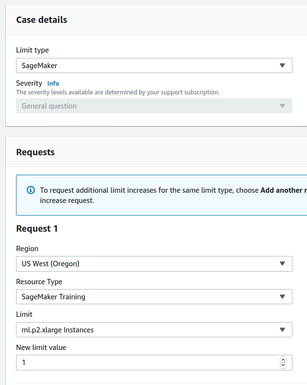

# AWS DeepLens Camera Setup

Olivia Lund, Fall 2020

### This is a guide for configuring the Amazon Web Services DeepLens camera for use with this project. There are no requirements other than having the camera.

## 1. Prep work 

### 1.1: Registering the camera

To begin, navigate to [https://aws.amazon.com/deeplens/](https://aws.amazon.com/deeplens/).

From there, select "Register your DeepLens" to begin the process.

On the next page, select "Register device" to continue.

This prompts the user with a dialog box asking which version of the DeepLens is being used.

The next page is a set of very detailed instructions on carrying out the registration. Make sure to save the certificate, which is necessary for changing data on the device and will not be available again.

## 1.2: Configuring the camera project

If registration was successful, navigating to [https://us-east-1.console.aws.amazon.com/deeplens/home?region=us-east-1#devices](https://us-east-1.console.aws.amazon.com/deeplens/home?region=us-east-1#devices) will look like the following image

Select the device to navigate to its details page

If the device registration failed, select "Deregister" and try the registration process again starting with section 1. 

If the registration was successful, select "Deploy a project"

The template projects are worth looking at, but their scope is very narrow. In order to fulfill the requirements of this project, it will be necessary to create and train a new model. 

## 1.3: Requesting a service limit increase for training models

This step isn't going to be useful until it's time to train the model, however it's going to take time for AWS Support staff to respond, so it's a good idea to consider doing it as early as possible. It took them about six hours to get back to me, but this likely has a huge degree of variability. This information is copied from [https://docs.aws.amazon.com/deeplens/latest/dg/deeplens-getting-started-launch-sagemaker.html](https://docs.aws.amazon.com/deeplens/latest/dg/deeplens-getting-started-launch-sagemaker.html)

The standard VMs provided by AWS lack the powerful GPU that is necessary for training a SageMaker model, and as a result a request ticket has to be created. First, navigate to [https://console.aws.amazon.com/support/home#/case/create](https://console.aws.amazon.com/support/home#/case/create) and select Service Limit Increase

From there, fill out the following information in the "Case details" and "Requests" sections:

The last field is for the case description. This should have a short explanation of why the additional resources are necessary. Simply explaining that the GPU-enabled machines are to be used with TensorFlow to train a deep learning model for using on a DeepLens device should suffice. 

## 2: Preparing to create a model

For this section, this guide was immensely helpful for learning how to get started:
[https://docs.aws.amazon.com/deeplens/latest/dg/deeplens-getting-started-hard.html](https://docs.aws.amazon.com/deeplens/latest/dg/deeplens-getting-started-hard.html)

### 2.1: Creating a storage container to store training data in

Before training can occur, a model is simply a collection of data, and needs to be stored somewhere. Amazon requires that training data be stored in an S3 bucket before training with it.

To set up the S3 bucket, from the Services menu on the main console, search for "S3" and enter the S3 console. 

Once in the S3 console, select "Create a Bucket"

From the bucket creation menu, create a name that begins with deeplens-sagemaker- which allows both DeepLens and SageMaker to recognize it. The rest of the settings can be left default.

Now, from the S3 console, select the newly created bucket and click upload:

It's now possible to add the data desired for training the model with.
This project was intended for converting handwritten data on paper forms into spreadsheets. The forms were scanned into PDF and then converted to JPG to make it easier for a machine learning program to read them. CSV files were created manually for each of the forms. Each set of documents was added to a folder and uploaded to the bucket. 

### 2.2: Entering the Sagemaker Studio

From the AWS services menu, select SageMaker studio from under Machine Learning:

In order to enter the studio, a SageMaker specific account will have to be created:

A user IAM role will have to be created as well, if one wasn't created in order to enter the S3 console in step 2.1:

Fortunately, this is relatively straightforwards, and all permissions can be left default:

After hitting "Create Role", this screen should appear:

Once this is complete, after a brief readying period, it should be possible to select "Open Studio" from the far right of the window:

The studio should show a splash screen with a characteristic dark background:

### 2.3: Creating a Notebook

From the Sagemaker Console (which has a white background, not the Sagemaker Studio, which has a dark background), select "Notebook instances" from the menu on the left:

Choose "Create notebook instance" from the menu on the right:

This notebook doesn't need any particular name, but should have an instance type of ml.p2.xlarge in order to facilitate training faster.

Once this is done, open the notebook in Jupyter Notebooks. This notebook will be used to contain, document, and run the python code used to conduct the training. 

## 3: Training a model

Unfortunately, this segment of the tutorial was never completed due to time constraints in the original project. Some useful resources for learning model training include [this official AWS repo of functioning example projects](https://github.com/aws/amazon-sagemaker-examples) and [this part of the DeepLens tutorial which walks through importing one of the example projects and using it to train a model](https://docs.aws.amazon.com/deeplens/latest/dg/deeplens-getting-started-launch-sagemaker.html). 
